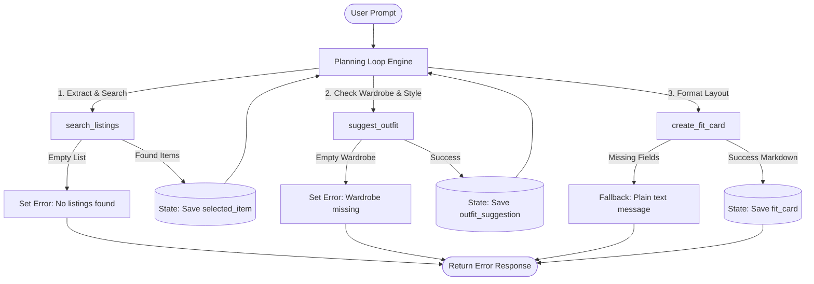

# FitFindr — planning.md


## Tools

### Tool 1: search_listings

**What it does:**
Searches an inventory database for clothing listings that match a user-given textual description, size requirement, and maximum budget constraint.

**Input parameters:**
- `description` (str): Text keyword or style phrase to search for.
- `size` (str): Target clothing size (e.g., "M", "L"). Return `None` or `"Any"` if unrestricted.
- `max_price` (float): The maximum price the user is willing to pay.

**What it returns:**
A list of dictionaries representing matching inventory items. Each dictionary contains:
- `id` (int): Unique identifier.
- `title` (str): Item title.
- `price` (float): Cost of the item.
- `size` (str): Size of the item.
- `condition` (str): Quality description (e.g., "Excellent", "Good").

**What happens if it fails or returns nothing:**
If no listings match, the tool returns an empty list `[]`. The planning loop will immediately halt processing, set a descriptive error message in the session state ("No items found matching your criteria. Try loosening your price or keyword constraints."), and report this directly back to the user.

---

### Tool 2: suggest_outfit

**What it does:**
Takes a newly selected clothing item and the user's existing wardrobe profile to generate a structured outfit combination suggestion.

**Input parameters:**
- `new_item` (dict): The target item dictionary returned from `search_listings` (containing `id`, `title`, `price`, etc.).
- `wardrobe` (dict): A dictionary representing the user's available wardrobe categorized by types (e.g., `{"pants": ["baggy jeans"], "shoes": ["chunky sneakers"]}`).

**What it returns:**
A dictionary containing the combined outfit plan:
- `base_item` (str): The title of the newly found item.
- `complementary_pieces` (list of str): Selected items from the user's wardrobe that pair well.
- `styling_rationale` (str): A brief paragraph about why the combination looks good together.

**What happens if it fails or returns nothing:**
If the user's wardrobe is empty or missing necessary  categories, the tool returns a dictionary with an execution error. The agent intercepts this and tells the user: "We found the item, but your wardrobe profile appears to be empty! Tell me what you have in your closet so I can style it for you."

---

### Tool 3: create_fit_card

**What it does:**
Compiles the item and styling information into a beautifully formatted, clean Markdown text block ("Fit Card") designed for the user to read or share.

**Input parameters:**
- `outfit` (dict): The complete outfit dictionary generated by `suggest_outfit`.

**What it returns:**
A string containing the visual summary block of all of the above formatted with clear headers, bullet points, emoji accents, and an overall price/style breakdown.

**What happens if it fails or returns nothing:**
If the incoming outfit dictionary is missing mandatory keys like `base_item` or `styling_rationale`, the tool returns `None`. The agent catches this and logs a validation warning to the session state.

---

## Planning Loop

**How does your agent decide which tool to call next?**
The agent uses a strict condition pipeline, as described below:

1. **Initialization:** Parse the user query to extract relevant variables (`description`, `size`, `max_price`, and details about their current `wardrobe`).
2. **Step 1 Rule:** Execute `search_listings`. Check `results`.
   - *Condition A:* If `len(results) == 0`, set `error = "No inventory match"` and immediately terminate the loop.
   - *Condition B:* If `len(results) > 0`, extract `results[0]` (best match), assign it to `selected_item`, and proceed to Step 2.
3. **Step 2 Rule:** Check if `wardrobe` is empty. 
   - *Condition A:* If empty, set `error = "Wardrobe empty"` and terminate.
   - *Condition B:* If populated, execute `suggest_outfit(selected_item, wardrobe)`. Set the return object to `outfit_suggestion` and proceed to Step 3.
4. **Step 3 Rule:** Verify `outfit_suggestion` has valid properties.
   - *Condition A:* If keys are missing, set `error = "Card generation payload invalid"` and terminate.
   - *Condition B:* If valid, call `create_fit_card(outfit_suggestion)`. Save the string output to `fit_card`.
5. **Termination:** Return the session state. If `error` exists, print the custom error message. Otherwise, print `fit_card`.

---
## State Management

**How does information from one tool get passed to the next?**
The program keeps a single object tracker called `SessionState` active from start to finish. The tools do not share information with each other directly. Instead, when a tool finishes, it sends its data back to the main loop. The loop saves that data inside the state tracker, and then reads from the state tracker to pass parameters into the next tool call. The tracker keeps up with the user's search text, budget limit, closet list, selected item, outfit recommendations, and any error messages that happen along the way.

---
## Error Handling

For each tool, describe the specific failure mode you're handling and what the agent does in response.

| Tool | Failure mode | Agent response |
|------|-------------|----------------|
| search_listings | No results match the query | Stops the loop early, sets the error tracker, and displays: "No items found matching your criteria. Try loosening your price or keyword constraints." |
| suggest_outfit | Wardrobe is empty | Stops the loop early, sets the error tracker, and displays: "We found the item, but your wardrobe profile is empty! What is in your closet?" |
| create_fit_card | Outfit input is missing or incomplete | Avoids crashing by using a fallback function that displays a basic, unformatted text summary of the items instead of the fancy card layout. |


---
## Architecture


---
## AI Tool Plan

**Milestone 3 — Individual tool implementations:**
- **AI Tool:** Claude Code
- **Input:** The `## Tools` spec section from this markdown file, plus a description of what our local dataset fields look like.
- **Expected Production:** Three separate, working Python functions in `tools.py` that use the exact arguments and return types as laid out.
- **Verification Strategy:** Write some small unit tests using mock data—one where everything works, one with an empty search result, and one with a broken wardrobe setup—to make sure our error-handling guards and edge cases work right.

**Milestone 4 — Planning loop and state management:**
- **AI Tool:** Claude Code + Gemini.
- **Input:** The `## Planning Loop`, `## State Management`, and the Mermaid flowchart code blocks from this document.
- **Expected Production:** A central orchestrator function loop that sets up a session state dictionary, steps in order, handles exceptions without crashing, and updates the state cleanly at each step.
- **Verification Strategy:** Run an end-to-end production with a perfect query, and then test the broken paths by passing things like a $0 budget or an empty wardrobe to double-check that the loop safely cuts off exactly where it's supposed to.

---
## A Complete Interaction (Step by Step)

**Example user query:** "I'm looking for a vintage graphic tee under $30. I mostly wear baggy jeans and chunky sneakers. What's out there and how would I style it?"

**Step 1:**
The system reads the message and sets up the variables: `description="vintage graphic tee"`, `size="Any"`, `max_price=30.0`, and copies the wardrobe over: `wardrobe={"bottoms": ["baggy jeans"], "shoes": ["chunky sneakers"]}`. Afterwards, it runs the search tool: `search_listings(description="vintage graphic tee", size="Any", max_price=30.0)`.

The database then finds an item and returns a list: `[{'id': 104, 'title': '90s Nirvana Grunge Tee', 'price': 25.0, 'size': 'L', 'condition': 'Excellent'}]`, and the loop grabs this item and saves it as `selected_item`.

**Step 2:**
The system confirms `selected_item` exists and checks the user's closet list. Since the closet list is not empty, it goes ahead and runs the styling tool: `suggest_outfit(new_item=selected_item, wardrobe=wardrobe)`. The styling tool then reads the items and returns an outfit dictionary:
```python
{
    'base_item': '90s Nirvana Grunge Tee',
    'complementary_pieces': ['baggy jeans', 'chunky sneakers'],
    'styling_rationale': 'Pairing the oversized 90s Nirvana graphic tee with loose baggy jeans leans heavily into a classic retro skate/grunge aesthetic, completed cleanly by the profile of your chunky sneakers.'
}
```
The loop grabs this result and saves it as outfit_suggestion.

**Step 3:**
The system checks the keys inside `outfit_suggestion`, and because everything looks correct, so it calls the layout formatting tool: `create_fit_card(outfit=outfit_suggestion)`. The layout tool rearranges the details into a single formatted string and saves it as `fit_card`.

**Final output to user:**
### YOUR FITFINDR STYLE CARD 

### The Found Piece
* **Item:** Faded Band Tee ($22.00)
* **Source/Condition:** Depop / Good condition

### Suggested Layout Combination
* **Coordinating Pieces:** wide-leg jeans, platform Docs
* **Styling Profile Notes:** "Pair this with your wide-leg jeans and platform Docs for a classic 90s grunge look. Roll the sleeves once and tuck the front corner slightly for shape."

### Caption Preview
"thrifted this faded band tee off depop for $22 and honestly it was made for my wide-legs 🖤 full look in my stories"
